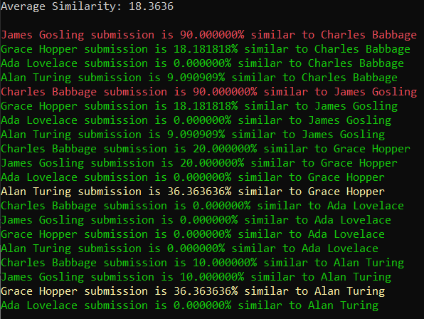

# README 

ZEBRA: Similarity Detector

## How to Run

1. Download the executable and save if in the folder where the files to compare and located.
2. Open terminal and go to the directory where the executable and files to compare are located.
3. Run ```dir /b > filenames.txt``` in terminal. (The name "filenames" is optional. The file can be named something else.)
4. Optional: For testing student submissions, if you want the program output to have the student's names listed as FIRST LAST, instead of the Canvas naming system LASTFIRST, then copy the names of all the students and paste them into a file with each line being a single name.
Ex:
Charles Babbage
James Gosling
Grace Hopper
Ada Lovelace
Alan Turing
5. Run ```ZEBRA filenames.txt```. If using a list of student names, run ```ZEBRA filenames.txt studentnames.txt```. (Use the names of the textfiles within the folder, not the names given here, unless the textfiles are named filenames and studentnames, respectivly.)
6. Choose an option in the menu that matches the language used within the files for better results. If none of the options match, choose the "None Listed" option.

## Understanding Results

[ ]  There are three colors for results: green, yellow, and red. 
*  Green: Low to no similarity. This coloring is used to signify any submissions that are under 10% above the average similarity. Any similarities are most likely due to assignment requirments. 
*  Yellow: Slightly higher than normal similarity. This coloring is used to signify any submissions that are between green and red standards. 
*  Red: High similarity. This coloring is used to signify any submissions that are over 30% above the average similarity. These submissions may have identical code.

## Additional Notes
If Canvas anonymous grading is used, the file names will have numbers instead of names. The program output will output these numbers instead of the student's names.
